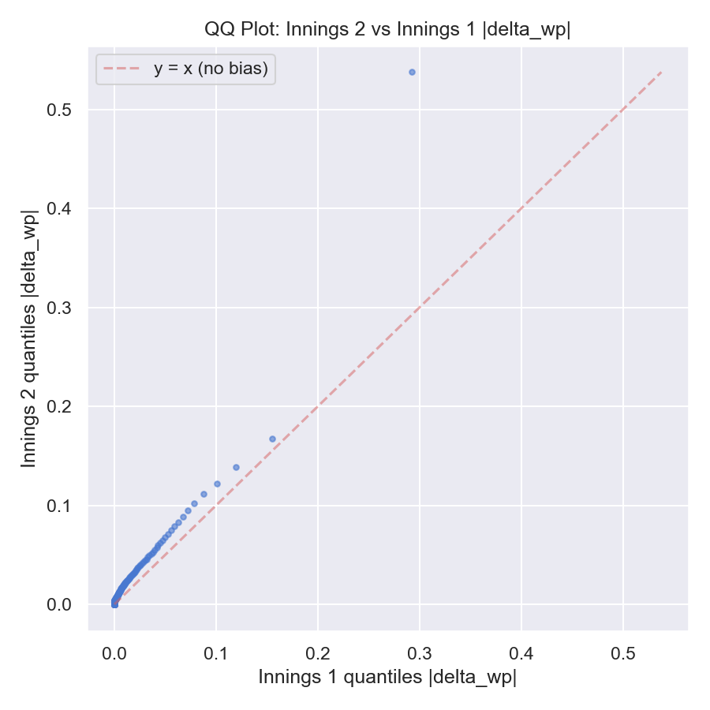
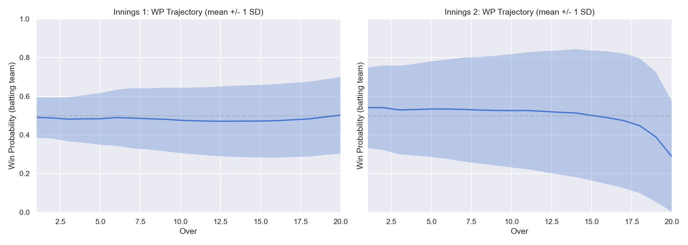
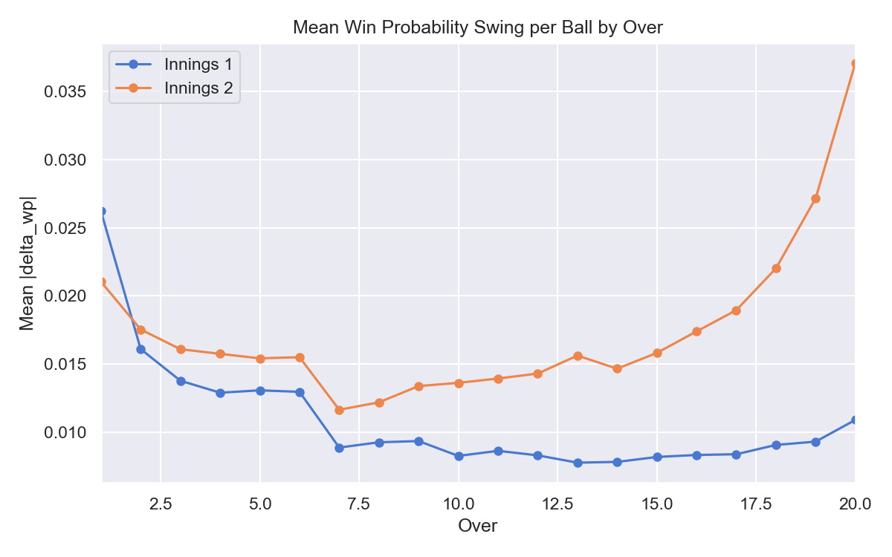

# About TILT

**A technical overview of how every IPL delivery is converted into Win Probability Added.**

TILT is a player-impact metric for the Indian Premier League. For every legal delivery in IPL history we estimate the change in win probability that delivery produced and attribute it to the batsman and bowler involved. Aggregated across a player's career, this is their TILT — a *win probability per match* number that captures **when** they performed, not just **what** they did.

This page is the long-form methodology. The headline numbers and rankings live on the [leaderboard](index.html); the player and match pages drill into individual games. If you only want the one-line version: TILT is Win Probability Added for T20 cricket, with Bayesian shrinkage on top of a LightGBM ball-by-ball win probability model trained on Cricsheet data.

| Coverage | Value |
|:--|:--|
| Seasons | IPL 2007/08 — 2026 |
| Matches parsed | 1,159 |
| Legal-ish deliveries scored | 276,500+ |
| Players ranked (≥ 10 matches) | 443 |
| Model | LightGBM gradient-boosted classifier |
| Default ranking | Bayesian-shrunk TILT, 90% CI lower bound |

---

## 1. Motivation

Traditional T20 stats — average, strike rate, economy, dot-ball percentage — describe a player's *output*, but they treat all situations as exchangeable. A 30-ball 50 in a 200-run chase counts the same as a 30-ball 50 in a dead game at 70/0 in the powerplay. A wicket in over 4 with the score at 30/0 counts the same as a wicket in over 19 of a chase with 30 needed off 12.

Cricket fans don't think this way. They know that *context* — phase, target, wickets in hand, opposition strength, venue — radically changes what a piece of cricket is worth. The job of an impact metric is to put numbers on that intuition.

The standard tool from American sports for this is **Win Probability Added (WPA)**. You build a model that maps the state of the game to a probability that one side wins, then credit each player for moving that probability up or down. WPA has a long history in baseball, basketball, and the NFL. TILT is the IPL implementation.

What this gets you that classical stats don't:

- **Phase-aware.** A boundary in the death is worth more than a boundary in over 4, because it shifts the model's prediction more.
- **Wicket-aware.** Losing a set batsman when chasing is more damaging than losing a tail-ender at the end.
- **Opposition-aware.** Conceding 12 to KKR in 2024 with Narine batting is different from conceding 12 to a weak side. The model knows the opposition's recent form and the bowler's career economy.
- **Venue-aware.** A 180 at Chinnaswamy is below par; a 180 at Chepauk is winning. The model learns this.
- **Era-aware.** A strike rate of 140 in 2010 is elite; in 2025 it is below average. Season is a model feature.

What TILT is *not*: a perfect god-stat, a substitute for watching cricket, or a way to value fielding (see §10). It is one number that compresses ball-by-ball context into a per-match impact figure.

---

## 2. Data

All ball-by-ball data comes from [Cricsheet](https://cricsheet.org), the open cricket data project maintained by [Stephen Rushe](https://twitter.com/srushe). Cricsheet ships one JSON file per match with full ball-by-ball detail, toss, venue, dates, and outcomes.

The pipeline downloads the IPL ZIP, parses each match into a row-per-delivery table, and runs feature engineering on top.

### Schema (per delivery)

The parsed row carries everything the model and attribution layer need:

| Field | Meaning |
|:--|:--|
| `match_id`, `date`, `season`, `venue` | Match metadata |
| `batting_team`, `bowling_team`, `winner` | Sides and outcome |
| `innings`, `over`, `ball` | Position in the game |
| `batter`, `bowler`, `non_striker` (+ IDs) | Players on the field |
| `runs_batter`, `runs_extras`, `runs_total` | Runs from the ball |
| `is_wide`, `is_noball` | Legal-delivery flags |
| `is_wicket`, `wicket_kind`, `player_dismissed` | Dismissal info |
| `toss_winner`, `toss_decision` | Toss outcome |
| `dls_method` | Marked for filtering |

### Normalization

Cricsheet is excellent but raw cricket data is messy. The pipeline does a few cleanups:

- **Team name aliases.** "Royal Challengers Bengaluru" and "Royal Challengers Bangalore" collapse to a single canonical name. Likewise for the Punjab Kings / Kings XI Punjab / Punjab XI variants and the various Pune franchises.
- **Venue deduplication.** Cricsheet ships 59 raw venue strings — a mix of stadium-only and stadium-with-city ("Wankhede Stadium" vs "Wankhede Stadium, Mumbai") and renamings ("Feroz Shah Kotla" → "Arun Jaitley Stadium", "Sardar Patel Stadium, Motera" → "Narendra Modi Stadium, Ahmedabad"). After mapping, the model sees **38 canonical venues**, which materially reduces categorical overfitting.
- **Season parsing.** IPL seasons cross calendar years (e.g. "2009/10"). The pipeline takes the start year as the integer feature `season_numeric`.
- **DLS exclusion.** 22 DLS-affected matches are excluded from the model's training set — their outcomes don't reflect "fair" win probability — but the rest of the pipeline still scores them so players aren't penalised for appearing in them.
- **Player ID resolution.** Cricsheet ships short IDs; the pipeline resolves full names against Wikidata so the leaderboard can show e.g. "Sunil Narine" instead of the registry handle.

The cleaned dataset is what every downstream stage sees.

---

## 3. Feature Engineering

For each delivery the pipeline computes the **state of the match before the ball is bowled**. These 15 features are the model's inputs:

| Feature | Range | Description |
|:--|:--|:--|
| `innings` | {1, 2} | First or second innings |
| `balls_remaining` | 1 — 120 | Legal deliveries left in the innings |
| `wickets_in_hand` | 0 — 10 | Wickets the batting side still has |
| `runs_scored` | 0 — ~280 | Cumulative runs in the innings before this ball |
| `run_rate` | shrunk | Current scoring rate (see below) |
| `target` | 0 or 1+ | Chase target (0 in innings 1) |
| `runs_needed` | 0 or 1+ | Runs still required (0 in innings 1) |
| `required_run_rate` | 0 — 36 | Needed scoring rate (capped, 0 in innings 1) |
| `over` | 0 — 19 | Over number, kept continuous so trees can split it freely |
| `recent_wickets` | 0 — ~5 | Wickets fallen in the last 18 balls |
| `venue` | 38 levels | Categorical — handled natively by LightGBM |
| `batting_team_chose_to_bat` | {0, 1} | Toss winner who chose to bat |
| `season_numeric` | 2008 — 2026 | Era proxy |
| `opponent_bowler_economy` | rpo | Career economy of the bowler facing this ball |
| `batting_team_nrr` | NRR | Batting side's net run rate so far this season (prior matches only) |

A few of these are worth pulling out.

### A single model for both innings

There's a single LightGBM classifier shared between the two innings. For innings 1, `target`, `runs_needed`, and `required_run_rate` are zero. The `innings` feature acts as a switch — the model learns that innings 1 is about *setting a total* and innings 2 is about *chasing a known number*. This is simpler than maintaining two models and lets shared structure (venue effects, wickets-in-hand) be learned once.

### Run rate is shrunk, not raw

A naive "runs / overs" run rate explodes early in the innings: a four off the first ball reads as 24 rpo. That noise propagates into the model as huge implausible win-prob swings in over 1. The pipeline computes a **Bayesian-shrunk run rate** with a league-average prior:

```
PRIOR_BALLS = 18      # ~3 overs of prior weight
PRIOR_RPO   = 8.4     # ~league-average 1st innings rpo
PRIOR_RUNS  = PRIOR_BALLS * PRIOR_RPO / 6   # 25.2

shrunk_rr = (runs_scored + PRIOR_RUNS) / ((balls_bowled + PRIOR_BALLS) / 6)
```

By over 4 the prior is overwhelmed by real data. This single change removed a class of cartoonish over-1 deltas that were dominating early-game volatility.

### Opponent quality, without leakage

`opponent_bowler_economy` is the *career-level* economy of the bowler delivering the ball. It's a coarse but useful proxy for opposition quality: bowling a ball at a hitter is different from bowling it at a tailender, and facing a Bumrah delivery is different from facing a part-timer. Career economy is computed across the full dataset, used only as a static lookup at scoring time, and doesn't update mid-match.

`batting_team_nrr` is the **season-to-date net run rate of the batting side**, computed from prior matches only — never including the current game — so there is no leakage. It encodes "is this a strong team this year" in one number.

### Phase as a continuous feature

Earlier versions used three dummies (`is_powerplay`, `is_middle`, `is_death`). The current model exposes raw `over` (0–19) as an integer instead, and lets the trees pick their own split points. The dummies are still computed for downstream reporting but aren't fed to the model.

---

## 4. The Win Probability Model

The core model is a **LightGBM gradient-boosted binary classifier** that predicts whether the team currently batting will win the match, given the 15 features above.

```
Input  : 15 features describing match state before a ball
Output : P(batting team wins) ∈ [0, 1]
```

LightGBM is a good fit here for several reasons: it handles mixed continuous/categorical inputs natively (no one-hot for venues), it trains fast on the ~276K-row dataset, and it produces well-calibrated probabilities out of the box without a Platt scaler or isotonic step.

### Training configuration

These are the production hyperparameters from `config/pipeline_config.yaml`:

| Hyperparameter | Value | Rationale |
|:--|:--|:--|
| `n_estimators` | 2000 | Big upper bound; early stopping picks the actual count |
| `learning_rate` | 0.03 | Low — paired with strong regularization for smoother probabilities |
| `max_depth` | 4 | Shallow trees prevent feature-interaction over-fitting |
| `num_leaves` | 16 | Matches the depth cap |
| `min_child_samples` | 500 | Heavy minimum-leaf-size to forbid tiny splits that produce ball-to-ball cliffs |
| `reg_lambda` | 5.0 | Strong L2 to flatten leaf values |
| `test_size` | 0.2 | 80/20 split |
| `random_state` | 42 | Reproducibility |

The model uses **monotone constraints** on three features whose direction is unambiguous from the batting team's point of view: `wickets_in_hand` is forced monotonically positive, `runs_needed` and `required_run_rate` are forced monotonically negative. This blocks pathological splits where, say, the model accidentally learns that needing more runs is *good* in some narrow regime.

### Train/test split is by match, not by ball

The single most important design decision in training is splitting by `match_id`, not by row. Balls within a match are extremely correlated (they share venue, teams, conditions, and the same outcome). A naive ball-level split would let the model memorise specific games and report inflated test-set numbers. The pipeline uses `GroupShuffleSplit` keyed on `match_id` to keep all balls from a match on the same side of the split.

### DLS handling

Matches affected by DLS recalculation have unreliable "fair" outcomes — the actual win was determined by a rain rule, not by playing out the cricket. Those 22 matches are dropped from training. The rest of the pipeline still scores them so players aren't penalised for appearing.

### No post-hoc calibration

Older iterations applied Platt scaling on top of the raw classifier. With the current strong-regularization configuration that step is unnecessary — and it was actively harmful, because Platt amplifies mid-range probabilities and the resulting deltas were too volatile ball to ball. The committed model is the raw LightGBM probabilities, with calibration error empirically capped at ~4.5% across the predicted-probability bins.

---

## 5. Validation

The model is evaluated on the held-out 20% of matches (~235 games, ~57K balls).

| Metric | Value | Notes |
|:--|:--|:--|
| **Brier score** | 0.198 | Mean squared error between predicted prob and outcome. 0 is perfect; 0.25 is "always predict 0.5". |
| **Log loss** | ≈ 0.58 | Cross-entropy. Lower is better. |
| **AUC** | 0.761 | Discrimination — given a ball with a winner-side and loser-side, the model orders them correctly 76% of the time. |
| **Calibration error (max)** | ~4.5% | Across 10 probability bins, the largest gap between predicted and observed win rate. |

Brier under 0.20 is the implicit target for a usable WPA model — much above that and the per-ball deltas become too noisy to produce a meaningful aggregate. The current model clears it.

### Calibration

Calibration is the test most relevant to TILT, because TILT credits players the *difference* between two predicted probabilities. If the model's 30% predictions only win 15% of the time, every "drop from 50% → 30%" delta is overstated and players in those situations get over-credited.



The model lines up close to the diagonal across the full 0–1 range. The largest residual sits in the highest probability bins (0.85+), where the model is mildly under-confident — predicting 90% when the empirical rate is 92%. This is a much smaller bias than what Platt-scaled versions of the model produced.

### Sanity scenarios

The training script also runs a small set of hand-built scenarios on every retrain to catch obvious regressions. Examples:

| Scenario | Expected | Why it matters |
|:--|:--|:--|
| Innings 2, need 2 off 6, 8 wickets in hand | > 0.90 | Trivially easy chase |
| Innings 2, need 60 off 6, 2 wickets in hand | < 0.05 | Effectively dead |
| Innings 1, ball 1, 0/0 | ≈ 0.50 | No information yet |
| Innings 1, 200/2 off 18, dominant | > 0.70 | Posting a winning total |

If any of these flips after a retrain, the deploy doesn't ship.

---

## 6. Feature Importances

Default LightGBM split-count importances on the production model:

```
venue                        ████████████████████████████████  711
batting_team_nrr             ██████████████                    325
required_run_rate            ████████████                      270
wickets_in_hand              ███████████                       258
target                       ███████████                       254
run_rate                     █████████                         206
runs_needed                  █████████                         205
runs_scored                  ████████                          191
innings                      ██████                            153
season_numeric               ██                                 54
opponent_bowler_economy      ██                                 46
recent_wickets               █                                  26
batting_team_chose_to_bat    █                                  19
over                         █                                  16
balls_remaining              ▏                                  11
```

A few things to read out of this:

- **Venue dominates.** Conditions matter enormously in cricket and the 38-level categorical is doing a lot of work — pitch behaviour at Chepauk vs Chinnaswamy vs Wankhede is real and the model is capturing it.
- **Team strength is #2.** `batting_team_nrr` lets the model down-weight the same scoreline differently for a top-of-table side vs a bottom side.
- **Chase mechanics dominate the next tier.** `required_run_rate`, `wickets_in_hand`, `target`, `runs_needed` all sit close together — exactly what you'd expect from a model that spends half its life predicting innings-2 outcomes.
- **`balls_remaining` looks tiny — it isn't.** Split count under-weights features that are highly correlated with others (here, `balls_remaining`, `over`, and the chase features all encode similar information). The model uses ball-position information; it just gets it from `over` and the chase-state features more often than from `balls_remaining` itself.
- **Era effects exist but are modest.** `season_numeric` shows up at 54 — enough to keep modern hitters from being treated as identical to 2010 hitters, not so much that it dominates.

---

## 7. From Win Probability to TILT

TILT is the *delta* in win probability across a ball, attributed to the players involved.

```
wp_before = model.predict(state_before_ball)
wp_after  = model.predict(state_after_ball)
delta_wp  = wp_after − wp_before     # batting team perspective

batter_credit = +delta_wp
bowler_credit = −delta_wp
```

A six in the death that takes the batting side from 40% → 55% is `delta_wp = +0.15`: the batsman gets +15 percentage points, the bowler gets −15. A wicket in the powerplay that drops a chase from 55% → 48% is `delta_wp = −0.07`: the batsman gets −7, the bowler gets +7.

A few details that matter for fair attribution:

- **Wides and no-balls.** Wides aren't credited to the batsman (they didn't face it); no-balls aren't counted against the bowler's *legal-delivery* count for per-ball stats. Both still produce a `delta_wp` and both still flow into the batting/bowling totals — the legal flags only affect denominators in per-ball reporting.
- **Wickets are credited to the bowler regardless of wicket-kind.** Run-outs are an exception flagged in the parsing step but credited the same way at the WP layer; a future model could reattribute based on fielder.
- **The non-striker gets nothing.** TILT only credits the two players directly involved in the delivery.

### What this looks like across a match



A typical IPL match plotted as `wp_before` over balls. The trajectory wanders flat through innings 1 (the model isn't sure what target will eventually matter), then resolves more aggressively through innings 2 as the chase math tightens. Big swings cluster at wicket falls and at boundary-or-dot inflection points in the death.

### Phase matters more than runs do



Mean absolute `delta_wp` rises monotonically through an innings. A wicket in over 1 of innings 1 barely moves the needle; a wicket in over 19 of innings 2 can swing 30 percentage points by itself. This is the heart of *why* TILT and runs-scored disagree — runs treat overs as exchangeable; TILT does not.

---

## 8. Aggregating to Per-Player TILT

A career TILT comes from summing every delivery a player was involved in and dividing by matches.

```
batting_total_tilt   = Σ delta_wp        over all balls the player batted
bowling_total_tilt   = Σ (−delta_wp)     over all balls the player bowled
total_tilt           = batting_total_tilt + bowling_total_tilt

batting_tilt_per_match = batting_total_tilt / batting_matches
bowling_tilt_per_match = bowling_total_tilt / bowling_matches
total_tilt_per_match   = total_tilt        / total_matches    (union of the two)
```

`total_matches` is the union of matches the player either batted or bowled in. An all-rounder like Sunil Narine therefore divides combined contribution across the same denominator he'd use for either role alone — there's no double-counting of matches.

---

## 9. Bayesian Shrinkage and Confidence Intervals

A 25-match player with a raw +6.5% TILT/match isn't necessarily better than a 200-match player at +5.5%. Their estimate is just noisier. Without correction, leaderboards are dominated by small-sample players who got lucky.

The pipeline applies **empirical Bayes / James–Stein shrinkage**, pulling each player's raw TILT toward the population mean by an amount that depends on how many matches they have:

```
shrunk = (n / (n + k)) * raw + (k / (n + k)) * pop_mean
```

`k` is the **within-player variance ÷ between-player variance**, estimated empirically from match-level TILT distributions. For IPL data, **k ≈ 5.3**.

What that means in practice:

| Matches | Raw weight | Population weight |
|:--|:--|:--|
| 5 | 49% | 51% |
| 18 | 77% | 23% |
| 50 | 90% | 10% |
| 120 | 96% | 4% |
| 188 | 97% | 3% |

A high-raw-TILT player with 18 matches will see their number pulled noticeably toward the league mean; a 188-match veteran will barely move.

### Posterior confidence intervals

On top of shrinkage the rankings expose a **90% credible interval** on each player's TILT, computed from the *posterior* variance:

```
posterior_se = sqrt(within_var / (n + k))
ci_lower_90  = shrunk − 1.645 * posterior_se
ci_upper_90  = shrunk + 1.645 * posterior_se
```

Posterior — not frequentist `s/√n` — because shrinkage itself buys back some of the uncertainty by borrowing strength from the population. Using the frequentist SE here would double-count noise.

The default leaderboard sort is the **lower bound of the 90% CI** ("TILT floor"). This naturally penalises small samples without the usual blunt-instrument fix of a hard match cutoff. A player can post a higher raw TILT than someone above them and still rank lower because their interval is wider.

### Minimum thresholds

Two hard cutoffs survive the soft Bayesian penalty:

- **10 matches** to appear in rankings at all (below this the noise is too large for shrinkage to rescue).
- **50 balls in role** to display per-role (batting-only or bowling-only) numbers.

### Confidence labels

A plain-English tag for each player based on raw match count:

| Confidence | Matches |
|:--|:--|
| **high** | ≥ 100 |
| **medium** | 30 — 99 |
| **low** | 10 — 29 |

---

## 10. Known Biases and Limitations

TILT is honest about what it doesn't see.

### The second-innings asymmetry

Win probability swings are **structurally larger in the 2nd innings**, because the target is known and every ball directly resolves the chase math. On average, a 2nd-innings ball produces a `|delta_wp|` that is **1.54×** a 1st-innings ball. This is concentrated in the death overs — **2.66× in overs 16–20** — while powerplay overs are essentially equal (1.07×).

The downstream effect on single-match GOAT-type rankings is large: 94% of the top-50 batting GOAT performances and 98% of the top-50 bowling GOAT performances are from 2nd innings. The GOAT page therefore exposes innings-filtered views so within-innings comparisons are fair.

The effect on **career** rankings is small. The Spearman rank correlation between raw and innings-normalized career TILT is **ρ = 0.99** — careers wash out the per-match asymmetry.

The full diagnostic, including per-phase breakdowns and the qq-plot above, is at: [The Second Innings Problem](notes.html?note=innings-bias).

### The innings-boundary recalibration

The match-page win-probability chart shows a visible **jump** between the last ball of innings 1 and the first ball of innings 2, even though no ball has been bowled between them. This isn't a rendering bug — it's the model honestly re-pricing the game state once the chase target is locked in.

Several features restructure at the boundary in one step: `target`, `runs_needed`, and `required_run_rate` go from 0 (innings 1 placeholder) to concrete values; `balls_remaining` resets from ~1 back to 120; `wickets_in_hand` resets to 10; the `innings` switch flips from 1 to 2. The model has learned that innings 1 ending at state *S* and innings 2 starting with the corresponding target are two different distributions of match outcomes.

Across all 1,169 matches with both innings, from the batting-first team's perspective:

- **Median |jump|** is **8.4 pp** and 42% of matches jump by at least 10 pp.
- **Mean signed jump is −5.1 pp** (one-sample t-test p ≈ 10⁻⁴⁶) — the model systematically favors the chasing side at the switch, most strongly when innings 1 ended with lots of wickets still in hand.
- The bias has shrunk over seasons: it was ~−8 pp in the early 2010s and is near zero for 2025–2026.

The match chart marks the boundary with a dashed vertical line and breaks the line into two segments so the jump is visible-as-a-jump rather than a sloped connector that reads like continuous play. The per-ball TILT deltas inside each innings are unaffected — TILT is a within-innings `wp_after − wp_before` sum, so the boundary re-pricing never gets credited to any player. A structural fix (continuous features across the boundary, full retrain) is a candidate for the next model revision.

### What the model can't see

| Blind spot | Consequence |
|:--|:--|
| **Fielding** | Catches, run-outs, and misfields aren't credited to specific fielders. Excellent fielders are systematically under-rated. |
| **Batting position** | A #6 facing a collapsing innings looks like a #3 with a settled top order, to the model. |
| **Bowler type** | The model doesn't know pace vs spin. PaceOrSpin × Venue interactions would likely improve it; this is on the future-work list. |
| **Captaincy** | Strategic decisions (field placements, bowling changes) are invisible. |
| **Impact Sub rule (2023+)** | Substitutions distort match volatility; per-season analysis exists but no special treatment is applied yet. |

### Where the model is approximate, not wrong

- **Opponent quality is a single number.** `opponent_bowler_economy` is a career average — it doesn't know if a bowler is in form right now, or if they're matched up well against this batsman type.
- **Venue captures conditions, not weather.** A 38-level categorical knows nothing about whether the dew arrived in the second innings.
- **Team strength updates only between matches.** `batting_team_nrr` reflects season-to-date but can lag a recent change in form.

These are tractable upgrades that future iterations may chase.

---

## 11. Top Results (Sanity Check)

Top 10 players by **TILT floor** (90% CI lower bound). *As of 2026-04-20.*

| Rank | Player | TILT/Match | Raw | Confidence | Matches |
|:--|:--|:--|:--|:--|:--|
| 1 | Sunil Narine | +5.59% | +5.79% | **high** | 188 |
| 2 | Rashid Khan | +5.85% | +6.14% | **high** | 136 |
| 3 | Philip Salt | +6.57% | +7.76% | medium | 36 |
| 4 | Lasith Malinga | +4.46% | +4.73% | **high** | 120 |
| 5 | Yashasvi Jaiswal | +5.20% | +5.73% | medium | 68 |
| 6 | Priyansh Arya | +9.77% | +13.04% | low | 18 |
| 7 | Ruturaj Gaikwad | +4.52% | +4.97% | medium | 73 |
| 8 | AB de Villiers | +3.98% | +4.16% | **high** | 166 |
| 9 | KL Rahul | +3.84% | +4.06% | **high** | 133 |
| 10 | Yuzvendra Chahal | +3.30% | +3.46% | **high** | 171 |

A few sanity reads on this list:

- **Narine #1 across 188 matches** — the most consistent all-round impact in IPL history is exactly the kind of player a per-match WPA metric should surface, and it does.
- **Salt at #3 with 36 matches** is the floor ranking working: his raw TILT is the highest in the top 10, but the smaller sample means his interval is wider and he sits behind two veterans with tighter intervals.
- **Priyansh Arya at #6** with the highest raw TILT (+13.04%) on the page is *also* the floor ranking working: his 18-match interval is wide enough that the lower bound drops him six spots.
- **Old-era players are not punished.** AB de Villiers ranks #8 across an era spanning multiple T20 generations; the `season_numeric` feature successfully neutralises era effects.
- **Spinners and fast bowlers both surface.** Narine, Rashid, Malinga, Chahal — different bowling styles, all rated. The model isn't biased toward one type.

---

## 12. Reproducibility

Everything that produces the live numbers is in the [project repo](https://github.com/soldoutbudokan/Templates/tree/master/TheTilt):

| Stage | File |
|:--|:--|
| Cricsheet download | `pipeline/download_data.py` |
| Match parsing | `pipeline/parse_matches.py` |
| Feature engineering | `pipeline/build_features.py` |
| Model training | `pipeline/train_win_prob.py` |
| TILT computation + shrinkage | `pipeline/compute_tilt.py` |
| Static JSON export | `pipeline/export_json.py` |
| End-to-end orchestrator | `pipeline/run_pipeline.py` |
| Hyperparameters | `config/pipeline_config.yaml` |
| Trained model artifact | `models/win_prob_lgbm.pkl` (committed) |

Run `python pipeline/run_pipeline.py` from the repo root and you get the same numbers shown on this site, modulo whatever has been added to Cricsheet since the last refresh. The pipeline is deterministic given a fixed seed (`random_state=42`).

A GitHub Actions workflow refreshes the data twice daily (02:00 and 14:00 UTC) without retraining; full retrains run on March 1 each year and on demand.

---

*Data: [Cricsheet](https://cricsheet.org). Player names resolved via [Wikidata](https://www.wikidata.org). Aesthetic borrowed from [PlainCricket](https://plaincricket.vercel.app).*
