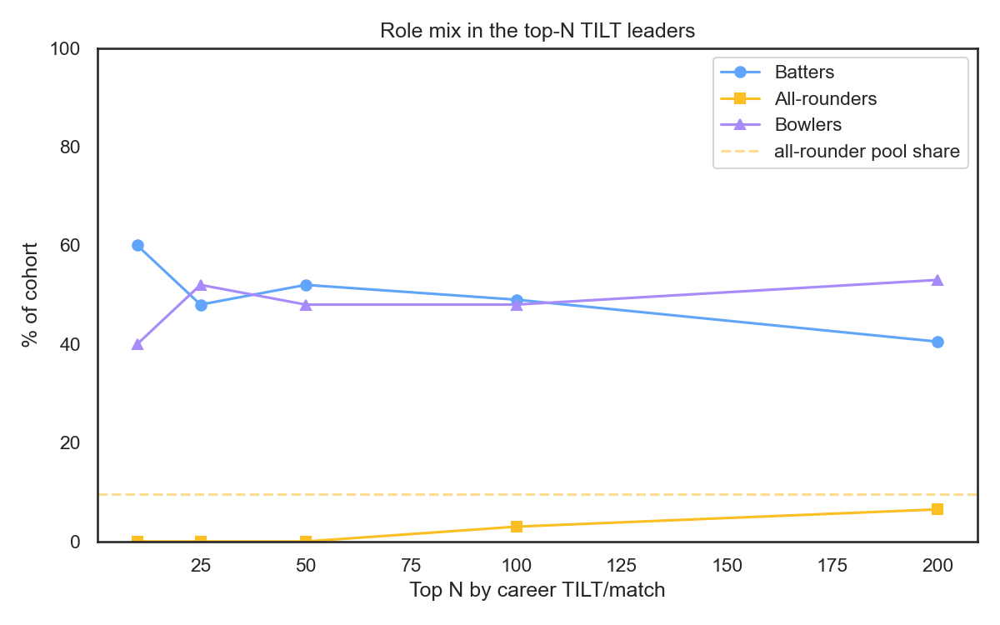
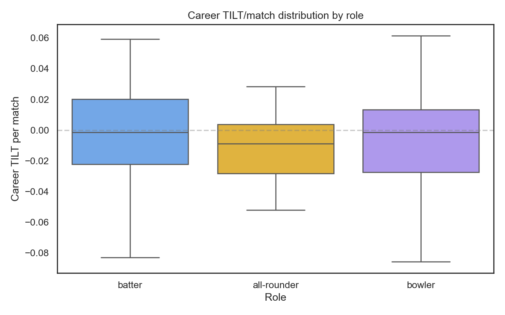
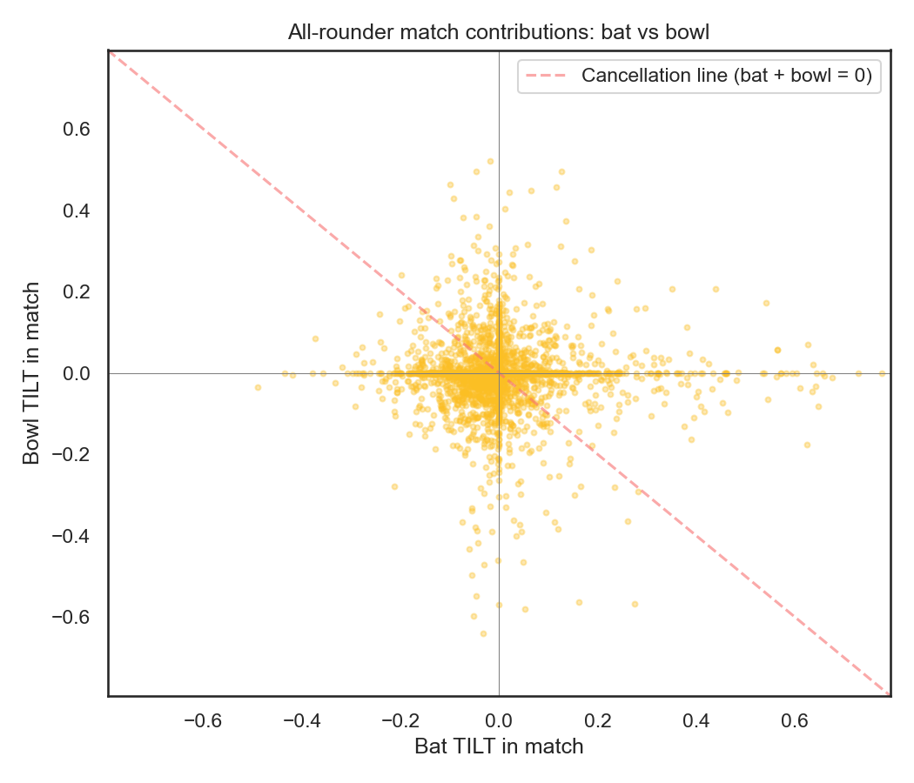
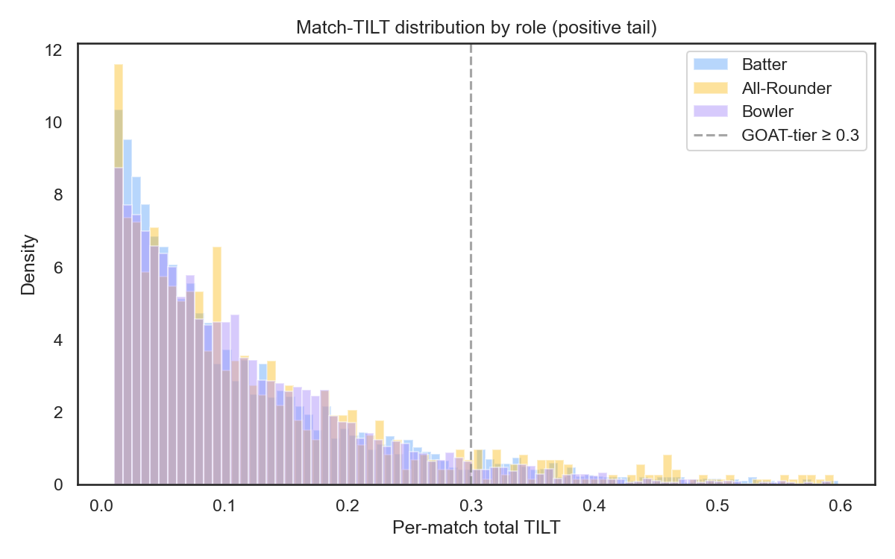

# Why TILT Underrates All-Rounders

**By raw per-match impact, zero all-rounders crack the top 50 and only three make the top 100. Two high-volume names — Yusuf Pathan and Maxwell — squeak into the top 50 on the leaderboard's consistency-weighted floor, but that's still well short of where their pool share says they belong. This is structural, not bias.**

If you sort the TILT leaderboard by raw per-match impact and scroll, something is missing. Russell, Pollard, Stokes, Watson, Pandya — the players who decide T20 matches by their dual-threat — sit far below where their reputation suggests they belong. The metric that asks "how much does this player tilt the game per match" produces a top-50 of batters and bowlers and not a single all-rounder.

This is not a bug. It's the math of measuring two roles at once.

---

## The Pattern

Of the 472 players with at least ten matches, 45 (9.5%) qualify as all-rounders under TILT's classification — at least 50 balls faced and 50 balls bowled, and a bat:bowl ratio between 0.3 and 3.0. If all-rounders performed like the rest of the pool, you'd expect about five of them in the top 50.

Ranked by raw per-match TILT — the unadjusted "how big is the swing per game" metric — there are none. Zero all-rounders in the top 50, and only three in the top 100.

| Top-N (raw per-match) | All-rounders | Expected at pool share | Ratio |
|:--|:--|:--|:--|
| 10 | 0 | 1.0 | 0.0x |
| 25 | 0 | 2.4 | 0.0x |
| 50 | 0 | 4.8 | **0.0x** |
| 100 | 3 | 9.5 | 0.3x |
| 200 | 13 | 19.0 | 0.7x |

The chart shows the gap. Across every depth — 10, 25, 50, 100, 200 — all-rounders are underrepresented. The longer the list gets, the closer they come to their pool share, but they never catch up.

One caveat worth being honest about: the leaderboard's *default* sort isn't raw per-match TILT — it's the 90% confidence floor (`tilt_ci_lower_90`), which rewards large, consistent samples and penalises small ones. On that floor sort, two veteran high-volume all-rounders do crack the top 50: Yusuf Pathan (161 matches) and Maxwell (139 matches), with five all-rounders in the top 100. So it's not strictly "zero in the top 50" on the page you land on. But two of an expected ~4.8 is still half-strength, and the moment you switch to raw impact per match, even those two fall out of the top 50 (Pathan #82, Maxwell #86). The under-representation holds under both metrics; it's just starkest on raw impact.

---

## The Distributions

Look at the boxes. Batters and bowlers have wide distributions with long upper tails — their best players sit well above the median. The all-rounder box is compressed: the 75th percentile is barely positive and the median is below zero.

| Role | n | Mean TILT/match | p75 | p90 | Top-quintile mean |
|:--|--:|--:|--:|--:|--:|
| Batter | 185 | -0.0019 | 0.020 | 0.035 | **0.043** |
| All-rounder | 45 | -0.0119 | 0.004 | 0.016 | **0.017** |
| Bowler | 242 | -0.0066 | 0.013 | 0.031 | **0.036** |

The top quintile of each role tells the story most cleanly. The best 37 batters average 0.043 TILT/match. The best 48 bowlers average 0.036. The best 9 all-rounders average **0.017** — roughly 40–50% of either specialist cohort.

That's the headline. An all-rounder at the top of their role is not even close to a specialist at the top of theirs.

---

## Why? The Cancellation Problem

This is every match an all-rounder has played, plotted by their batting TILT (x-axis) versus their bowling TILT (y-axis). The dashed line is the cancellation line — points below it have a positive bat and negative bowl, or vice versa, where the two contributions partially cancel.

44.1% of all-rounder matches are mixed-sign. They have a good batting day and a bad bowling day, or the reverse. Specialists never have this problem — a pure batter only has a bat row, a pure bowler only a bowl row.

The drag is quantifiable. If you treat each all-rounder match as if the bat and bowl contributions belonged to two different specialists, the average absolute impact is **0.123 TILT**. The actual combined value (where the contributions add up, including cancellation) is **0.103 TILT**. That's a **16.6% reduction** — pure cancellation drag, not a measurement issue.

| Match outcome | Share of all-rounder matches |
|:--|--:|
| Both bat and bowl positive | 10.0% |
| Both bat and bowl negative | **45.9%** |
| Mixed sign (cancellation) | 44.1% |

The 45.9% both-negative number is even worse than the cancellation. Almost half of an all-rounder's matches are *bad in both roles*. A specialist only has one role to be bad at; an all-rounder has two surfaces to fail on. Their floor is lower because they're exposed twice.

---

## The Counterintuitive Twist

This part is interesting. If you only look at the top tail of single-match performances, all-rounders aren't underrepresented at all.

| Role | % matches with TILT ≥ 0.30 (GOAT-tier) |
|:--|--:|
| Batter | 3.18% |
| **All-rounder** | **3.95%** |
| Bowler | 2.66% |

All-rounders actually produce GOAT-tier matches at the *highest* rate of the three roles — ahead of batters and well ahead of bowlers. When everything clicks — they bat 50 off 25 *and* take 2/15 — the combined TILT is enormous, and they get more "everything clicks" days than specialists do "perfect bat" or "perfect bowl" days.

So the underrating is not in their best matches. It's in the floor. All-rounders' explosive matches are normal-frequency, but their bad matches are worse.

You can see the same thing in the per-match standard deviation:

| Role | Match-TILT mean | Match-TILT std | p99 |
|:--|--:|--:|--:|
| Batter | 0.0034 | 0.127 | 0.446 |
| All-rounder | -0.0052 | **0.149** | **0.512** |
| Bowler | 0.0025 | 0.145 | 0.394 |

All-rounders have the highest variance and the highest p99 (their per-match p95 is 0.257). They are not boring middle-of-the-pack contributors. They are *boom-or-bust* contributors whose mean is the only one of the three to sit below zero, dragged there by deep busts.

---

## Where the Stars Actually Sit

For a sense of scale, here's where the famous IPL all-rounders rank — by the leaderboard's default floor sort and by raw TILT/match, the two metrics that disagree:

| Floor rank | Raw rank | Player | Matches | TILT/match |
|--:|--:|:--|--:|--:|
| 32 | 82 | YK Pathan | 161 | 0.0230 |
| 39 | 86 | GJ Maxwell | 139 | 0.0214 |
| 87 | 143 | KA Pollard | 179 | 0.0096 |
| 101 | 138 | SR Watson | 144 | 0.0108 |
| 173 | 234 | AD Russell | 133 | -0.0018 |
| 175 | 116 | BA Stokes | 45 | 0.0149 |
| 186 | 292 | **HH Pandya** | 159 | -0.0117 |
| 339 | 161 | JR Hopes | 20 | 0.0066 |

Yusuf Pathan and Maxwell lead the all-rounder block on the floor sort, and they're the only two inside the top 50 — both buoyed by 140-plus-match samples that the confidence floor rewards. Drop to raw per-match impact and both fall well outside the top 50 — the live ranks are in the table above. Hardik Pandya, the IPL's most decorated active all-rounder, sits at 186 on the floor and 292 on raw impact — above the pool median on the consistency floor, but below it on raw per-match impact. Russell and Pollard, two of the most decisive death-overs hitters in IPL history, land anywhere from the 80s to the 230s depending on which metric you trust.

Note the split personalities in that table. JR Hopes is the most extreme: a 20-match sample (one of them a DLS-shortened match whose re-scoring moved his career average materially) leaves his raw rank at #161 while the confidence floor — which prices in how *erratic* a sample is, not just how long — drops him to #339. Stokes is the mirror image of the veterans: 45 matches, a respectable raw #116, but a floor near #175 because the model doesn't trust the small sample. Sample size, not just role, drives where an all-rounder lands.

By comparison, the top of the leaderboard is full of specialists who concentrate their impact: Sohail Tanvir's bowling, AB Mhatre's and Vaibhav Suryavanshi's batting cameos, Priyansh Arya's small-sample heroics. None of them are diversified across roles. None of them are dragged down by a bad bowling day after a good bat.

---

## The Philosophical Reading

What does TILT actually measure? It measures how much a player's actions move win probability. That's a single-axis measurement. When a batter walks off with 80 not out chasing 200, the model rolls all of his impact into one number. When an all-rounder bats 25 off 18 *and* bowls four overs for 35, the same model splits him across both phases. Each contribution is competing against a more concentrated specialist on its own axis, and the all-rounder's bat day is being averaged with their bowl day.

Cricket fans reward versatility because a great all-rounder is genuinely harder to build a team around — he's a slot freed up, a batting depth bonus, a fifth bowler when the captain needs one. None of that shows up in a per-ball win-probability swing. The model sees only the events. And in events, focused specialists win.

You can argue this is a feature (a top-10 should reward concentrated dominance) or a bug (the rankings should value role flexibility). The data here doesn't take a side. It just makes clear that **the gap is structural** — half from cancellation in mixed-sign matches, half from a worse floor across both roles. It is not the model picking favourites or having a feature missing.

If you want to see all-rounders fairly, the per-match GOAT lists are the place to look. Their best games aren't just level with the specialists — they top the GOAT-tier rate. The career averages just have a different equation working against them.

---

*The numbers above come from `notebooks/all_rounders_analysis.py`. Cohort sizes and headline ratios will drift slightly across model retrains; the structural pattern is robust.*
