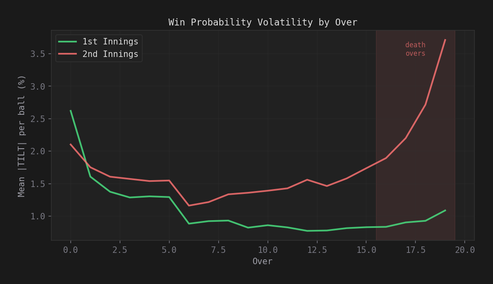
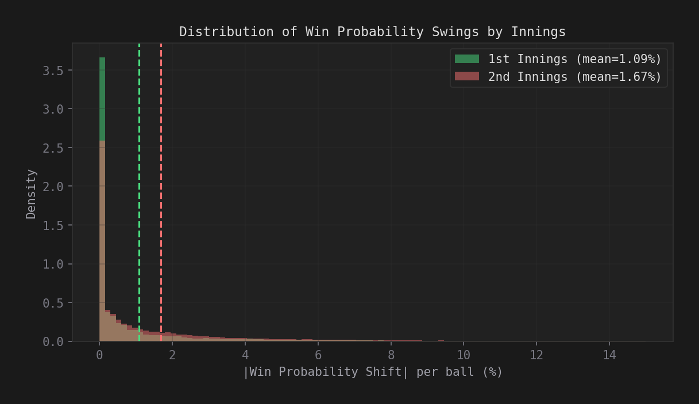
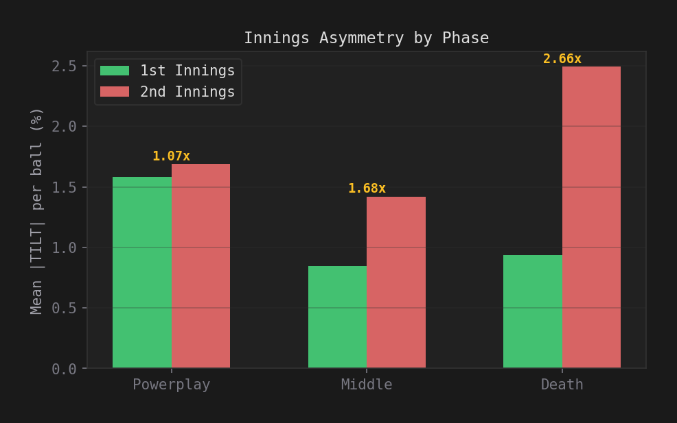
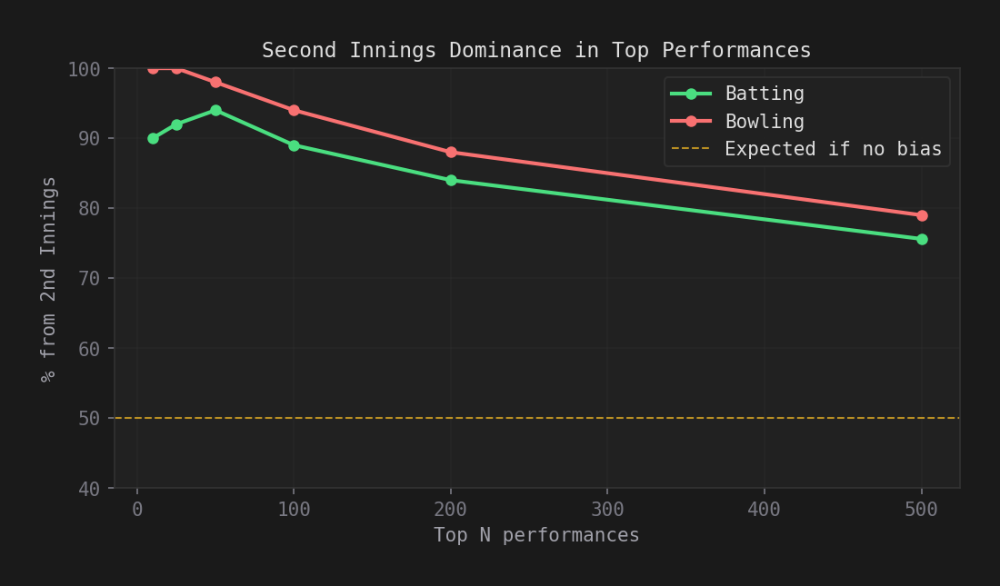
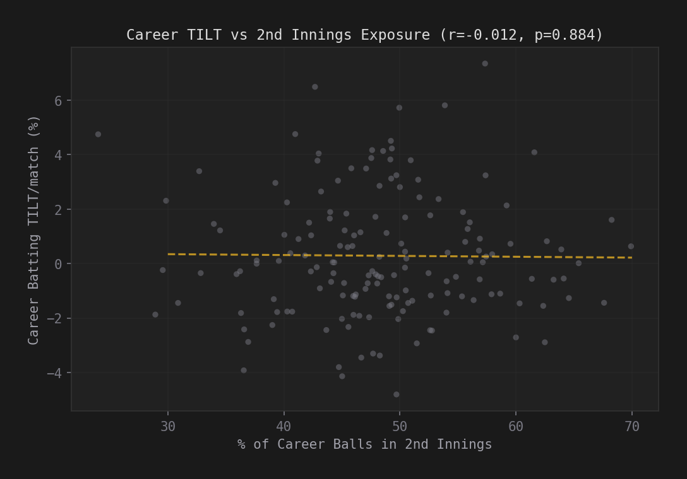

# The Second Innings Problem

**Why 94% of the greatest batting performances come from the 2nd innings.**

If you browse the GOAT performances page, you'll notice something immediately: nearly every top entry is from a chase. 47 of the top 50 batting performances and 49 of the top 50 bowling performances are from the 2nd innings. That's not random. It's a structural feature of how win probability works in cricket.

---

## The Core Asymmetry

Win probability swings are inherently larger when the target is known.

In the 1st innings, the model is predicting whether the batting team will eventually win — but it doesn't know what the target will be. A six in the 12th over nudges win probability gently because there are still 8+ overs of batting, then an entire second innings to play. The outcome is distant.

In the 2nd innings, the equation is precise: you need X runs from Y balls with Z wickets. Every run scored or wicket taken shifts the probability more aggressively because it's directly changing the math of a known equation. And by the final overs, each ball can swing win probability by 10-30%.

### The Numbers

| Metric | 1st Innings | 2nd Innings | Ratio |
|:--|:--|:--|:--|
| **Balls** | 143,076 | 133,436 | |
| **Mean WP shift per ball** | 1.088% | 1.674% | **1.54x** |
| **Death overs mean shift** | — | — | **2.66x** |
| **Middle overs mean shift** | — | — | **1.68x** |
| **Powerplay mean shift** | — | — | **1.07x** |

On average, a 2nd innings ball produces a win probability swing that is **1.54 times larger** than a 1st innings ball. But this isn't uniform — it's concentrated in the later overs.

---

## Where the Bias Lives

The chart tells the story. In the powerplay (overs 1-6), both innings are nearly identical — the ratio is just 1.07x. By the middle overs, it's 1.68x. And in the death overs (16-20), where matches are decided, 2nd innings balls produce **2.66x** the WP swing.

This makes intuitive sense. At over 18 of a chase with 20 needed from 12 balls, every boundary is a huge swing. At over 18 of a first innings at 160/4, a boundary changes the projected total by a few runs — the model can't be sure it will matter.

---

## The Distribution

The distributions overlap substantially for small WP shifts (the vast majority of deliveries). But the 2nd innings has a heavier right tail — more balls producing large swings in either direction. This is what drives the mean difference.

---

## Phase-Level Breakdown

The phase breakdown confirms the pattern. The powerplay is essentially fair — both innings produce similar-sized WP shifts. The asymmetry grows through the middle overs and explodes in the death.

| Phase | 1st Innings | 2nd Innings | Ratio |
|:------|:------------|:------------|:------|
| Powerplay | ~equal | ~equal | 1.07x |
| Middle | moderate gap | | 1.68x |
| Death | **large gap** | | **2.66x** |

---

## Impact on GOAT Rankings

This chart shows what percentage of the top-N single-match performances come from the 2nd innings. At the very top (top 10), it's nearly 100% for both batting and bowling. Even at top-500, it's still heavily skewed.

| Top N | % Batting from Inn 2 | % Bowling from Inn 2 |
|:------|:---------------------|:---------------------|
| 10 | ~100% | ~100% |
| 50 | 94% | 98% |
| 100 | ~90% | ~95% |
| 200 | ~85% | ~90% |
| 500 | ~75% | ~80% |

A brilliant 1st innings performance simply cannot produce the same magnitude of WP shift as a brilliant 2nd innings performance. A batter who scores an unbeaten 100 chasing 180 in the final over generates enormous TILT. A batter who scores 100 in the first innings setting 200 generates maybe a third of that.

---

## Does It Affect Career Rankings?

Here's the good news: **career rankings are barely affected**.

Over a career, most batters face a roughly similar mix of 1st and 2nd innings balls. The correlation between a player's 2nd-innings ball share and their career TILT is nearly zero. Players who chase more don't systematically rank higher.

When we normalize all deltas to remove the innings effect (scaling each innings' deltas so the mean absolute shift is equal), the career rankings barely move:

**Spearman rank correlation between raw and normalized career TILT: 0.985**

The per-match career TILT is robust because the innings effect washes out over many matches. It's only the single-match GOAT rankings that are heavily distorted.

---

## Why We Don't "Fix" This

We considered several approaches to correct for the innings asymmetry:

### Option 1: Normalize deltas by innings
Scale all 2nd innings deltas down by 1/1.54. This would equalize the mean absolute shift across innings but creates a different problem: a last-ball six to win a match would be worth the same as a six in the 3rd over of a dead rubber. The whole point of TILT is that context matters — deflating chase situations undermines the metric's reason for existing.

### Option 2: Separate models per innings
Train one model for batting-first and one for chasing. This could work in principle but doubles the modeling complexity and makes career TILT harder to aggregate. The current single-model approach with `innings` as a feature already handles the structural difference implicitly.

### Option 3: Innings-filtered views (what we did)
Rather than changing the underlying metric, we added innings filters to the GOAT performances page. You can now view the top batting and bowling performances within each innings separately, enabling fair within-innings comparisons.

This is the honest approach: the asymmetry is real and meaningful, so we show it rather than hiding it behind a normalization.

---

## What This Means for You

When browsing TILT data:

- **Career rankings** (the main leaderboard) are reliable. The innings effect washes out over many matches.
- **Single-match GOATs** are dominated by 2nd innings performances. Use the innings filter to compare fairly within each innings.
- **Season-level TILT** can be affected if a player disproportionately batted in one innings. Check the context before drawing conclusions.
- **The asymmetry is real, not an artifact.** Chasing genuinely does create higher-leverage situations. A match-winning chase *should* be worth more than a first-innings score — the question is only whether the 1.54x ratio is the right magnitude.

---

## Technical Details

The asymmetry arises from three features that are active only in the 2nd innings:

| Feature | 1st Innings Value | 2nd Innings Value | Feature Importance |
|:--------|:------------------|:------------------|:-------------------|
| `target` | 0 | Actual chase target | 402 |
| `runs_needed` | 0 | Runs still required | 337 |
| `required_run_rate` | 0 | Required scoring rate | 422 |

These three features account for approximately 32% of the model's total feature importance. They give the 2nd innings model much more precision about the match state, which translates to larger ball-by-ball probability shifts.

The full diagnostic analysis is available in `notebooks/innings_bias_analysis.py`.
