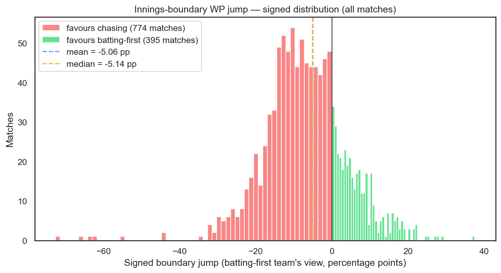
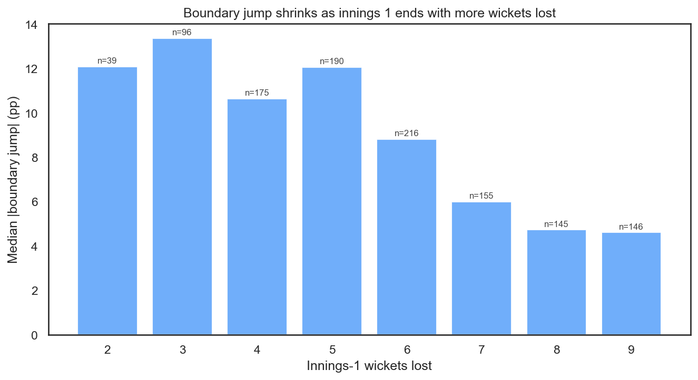
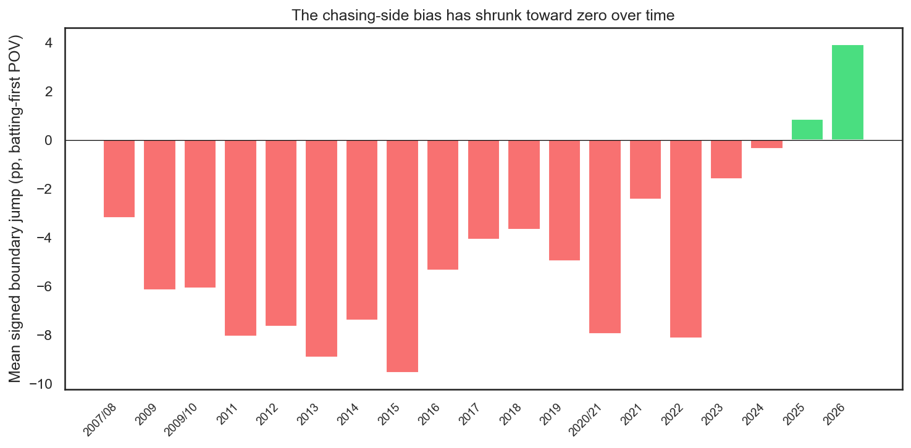
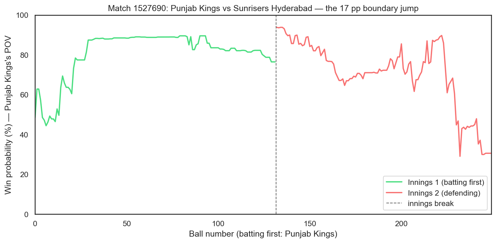

# The Innings-Boundary Jump

**Why the match-page chart leaps at the innings switch, even though nothing has been bowled.**

Load any recent IPL match on The TILT. Watch the win-probability line across the innings break. For most matches you'll see a visible *jump* — the line doesn't connect smoothly. No ball has been bowled between the last delivery of innings 1 and the first delivery of innings 2, but the batting-first team's estimated win probability shifts anyway. Sometimes by five percentage points. Sometimes by twenty.

This isn't a rendering bug. It's the model honestly re-pricing the game state as soon as the chase target is locked in. This post quantifies how big the jump is, why it happens, and what we've done about it.

---

## What actually moves at the boundary

The win-probability classifier takes 15 features. Several of them *restructure* the moment innings 2 begins, even though the match state is fundamentally unchanged:

| Feature | Last ball of innings 1 | First ball of innings 2 |
|:--|:--|:--|
| `innings` | 1 | 2 |
| `target`, `runs_needed` | 0 (placeholder) | the actual target |
| `required_run_rate` | 0.0 | a concrete rate |
| `balls_remaining` | ~1 | 120 |
| `wickets_in_hand` | whatever innings 1 ended on | 10 |
| `over` | 19 | 0 |

Six features move in one step. The `innings` switch is a hard categorical flip. The chase-math features (`target`, `runs_needed`, `required_run_rate`) go from zero — a dummy value the model uses throughout innings 1 — to the real numbers of the chase. `balls_remaining` and `wickets_in_hand` reset to fresh-innings values. `over` wraps from 19 back to 0.

This is what the model was trained on. It learned that "innings 1 ending in state *S*" and "innings 2 beginning with the corresponding target" live on different branches of the decision trees, and it produces a different probability for each. From the batting-first team's perspective the gap can look like a cliff.

---

## The jump is big and one-sided

Across all 1,169 matches with both innings in the dataset, we compute a **signed boundary jump** from the batting-first team's point of view:

```
boundary_jump = (1 − wp_before[first ball of innings 2])
              −      wp_after[last ball of innings 1]
```

Positive means the batting-first team's model-estimated win probability *rose* instantly at the switch. Negative means it fell.



A few things jump out of this histogram:

- **Median |jump| is 8.4 percentage points.** Not a rare tail case — the typical match produces a meaningful discontinuity.
- **42% of matches** have |jump| ≥ 10 pp. **21%** have |jump| ≥ 15 pp.
- **66.2% of jumps are negative** (favour the chasing side). The distribution is visibly skewed left.
- **Mean signed jump: −5.1 pp** (one-sample t-test against 0: t = −15.0, p ≈ 10⁻⁴⁶).

That last number is the key. The jump isn't centred on zero. The model systematically values the chasing side more than the batting-first side at the instant of the switch. Given the state "batting team has posted *T*, now we see it as a known chase," the model's second thought is a little more pessimistic about defending than its first thought was about batting first.

---

## Where the bias comes from: wickets

If you bin matches by how many wickets the batting-first team lost in innings 1, the |jump| magnitude tells a clean story:



| Inn-1 wickets lost | Typical boundary-jump magnitude |
|:--|:--|
| 0–3 (innings 1 barely disturbed) | ~10 pp |
| 4–6 | ~8 pp |
| 7–9 | ~6 pp |
| 10 (bowled out) | ~4 pp |

Spearman's ρ for magnitude vs wickets-lost is **−0.37** (p ≈ 10⁻³⁸). The jump is smallest when innings 1 ends with the batting-first side already rolled, and largest when they ended with the full hand intact.

The mechanical reason: `wickets_in_hand` is one of the features that resets at the boundary, and the size of that reset is exactly what this bin measures. A side that ended 200/3 steps from (innings 1, wih=7) to (innings 2, wih=10) — a big categorical jump in a feature the model leans on. A side that ended 140-all-out steps from (innings 1, wih=0) to (innings 2, wih=10) and the rest of the chase math dominates the picture. Paradoxically, it's the *strong* innings-1 positions that look most discontinuous.

---

## It's shrinking over time



Through the early 2010s the mean signed jump sat around −8 to −9 pp. From 2022 onward it has steadily moved toward zero and then past it: **+0.9 pp in 2025, +3.9 pp in 2026**. The sign has flipped for recent seasons — the model now slightly favours the batting-first team at the boundary.

We don't have a clean causal story here, but two candidates are worth flagging:

1. **Higher scoring rates.** Modern IPL produces bigger totals and the model has seen more 200+ innings-1 scores get successfully defended than it used to. At the boundary, a big total now nudges the prediction more favourably for the batting side than the same total would have in 2014.
2. **Impact-sub era.** From 2023 the Impact Player rule changes tail-end match dynamics, and the training set's distribution of innings-1 endings has shifted with it.

Either way, the bias is getting smaller with each retrain as more modern matches enter the training data. It isn't yet zero.

---

## A concrete example: match 1527690

[Punjab Kings vs Sunrisers Hyderabad, 2026](../match.html?id=1527690). SRH batted first and posted 219/6 off 20 overs. End of innings 1, the model had SRH at **76.5%** to win.

Then: zero balls of innings 2. Feature vector restructures. Model re-scores. SRH's win probability:



**76.5% → 93.7%**, a +17.2 pp jump. This particular match sits in the top quintile for magnitude, but the mechanism is identical to every other match — SRH ended innings 1 with 5 wickets still in hand, which is a large `wickets_in_hand` reset, which the model is sensitive to. SRH lost anyway, but that's not the point; the point is that the probability curve didn't honestly represent a single continuous view of the match.

---

## What we did (and didn't do)

The pragmatic fix is small: the match-page chart now breaks the line at the innings boundary and draws a dashed vertical marker labelled **innings break**. The jump is still visible — deliberately so — but it reads as a jump rather than a slope that implies continuous play. The chart now communicates what the model is actually doing: two separate probability estimates on either side of the switch, not a single continuous trajectory.

The per-ball TILT attribution is untouched. TILT is a within-innings `wp_after − wp_before` sum, so the boundary re-pricing is never credited to any player on either side. No rankings move because of this post.

What would a *structural* fix look like? Rebuild `build_features.py` so the feature vector is continuous across the boundary. Candidates:

- Replace `target` / `runs_needed` / `required_run_rate` with continuous score-difference and projected-total features that carry meaningful values through innings 1.
- Stop resetting `wickets_in_hand` and `balls_remaining` — let them carry as match-level counts, and let the model recover the innings-specific information from `score_diff` and a `phase` feature.
- Drop `innings` as a feature entirely, or replace it with a continuous "phase of match" encoding.

Any of these is a real feature-engineering project with a full retrain behind it, plus a fresh pass at the validation scenarios and the blog-post numbers that assume the current model. The bias is shrinking with each data refresh on its own, so the current plan is to incorporate the structural fix into the next annual retrain (March 2027 if nothing catches fire first) rather than rush it now.

Until then, the match page is honest about the discontinuity. Load any recent match, watch the line break, read the dashed vertical. That's what the model thinks happened between ball 120 and ball 121 — and now it's labelled, instead of hidden.

---

*Source: `notebooks/innings_boundary_analysis.py`. Every number above is printed by the notebook's summary block.*
