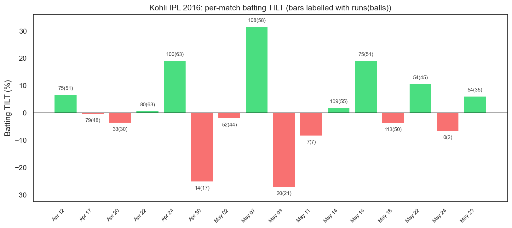
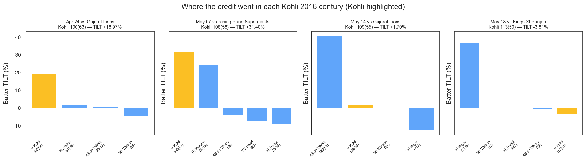
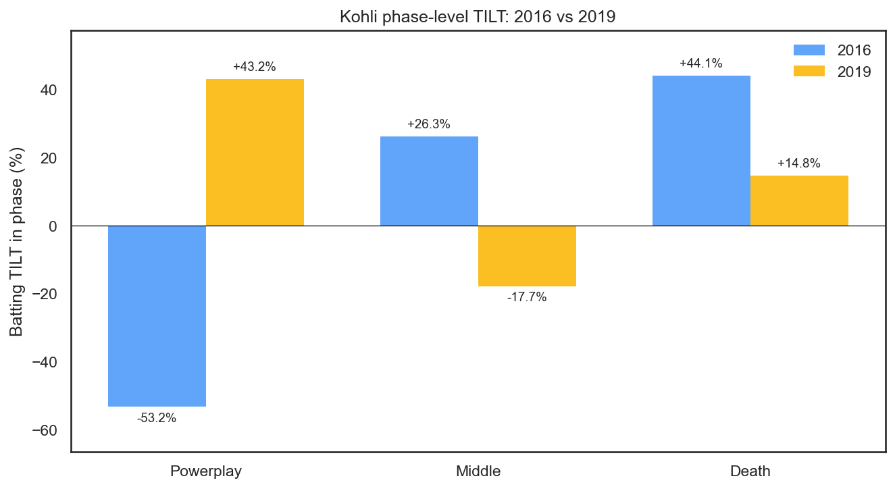
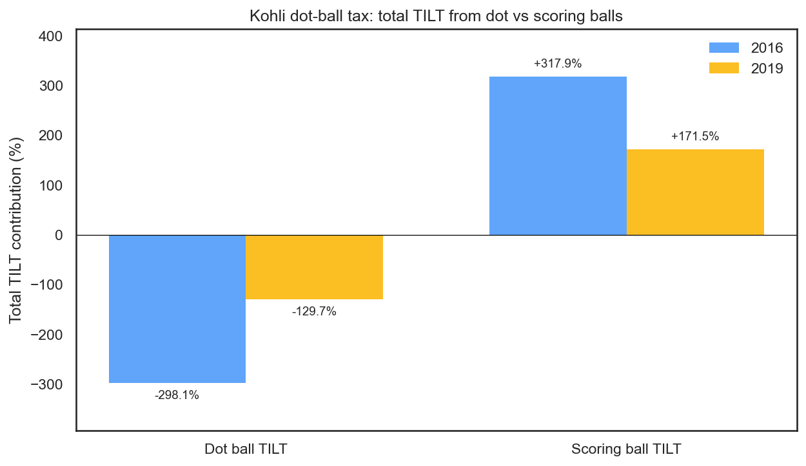
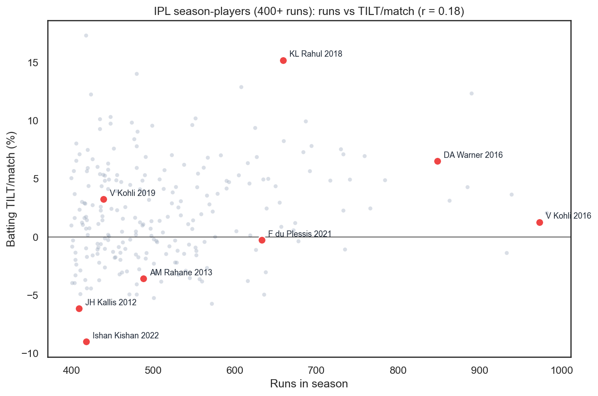
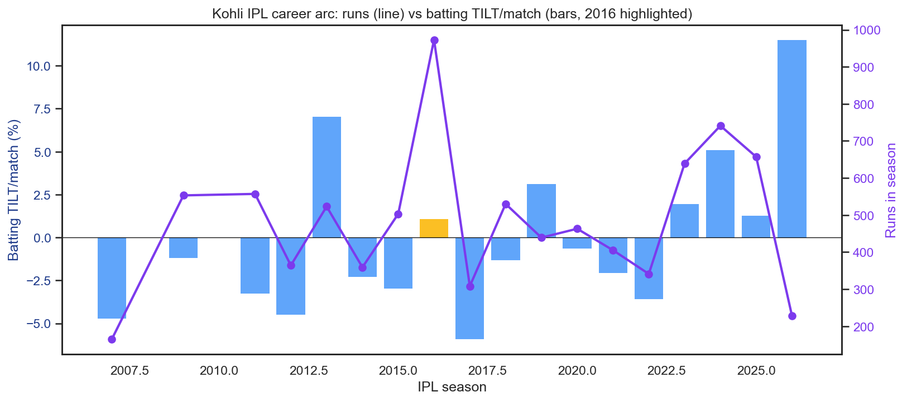

# The 2016 Kohli Dilemma: Why His Greatest Season Isn't His Best TILT Season

**973 runs at 152 strike rate. Four centuries. Seven fifties. And a TILT of +1.08% per match.**

Virat Kohli's 2016 IPL season is widely considered the greatest individual batting season in tournament history. The counting stats are staggering. But his TILT ranks it below his 2019 season (+3.10%), where he scored less than half the runs at a lower strike rate.

In this post, we dig into why this is happening and what it says about TILT.

---

## The Numbers

| | 2016 | 2019 |
|:--|:--|:--|
| **Runs** | 973 | 439 |
| **Balls** | 640 | 321 |
| **Strike Rate** | 152.0 | 136.8 |
| **Matches** | 16 | 13 |
| **Batting TILT/match** | **+1.08%** | **+3.10%** |
| **Total WPA** | +17.2% | +40.3% |
| **TILT per ball** | +0.027% | +0.126% |

The 2019 season generated **more total win probability added** from half the balls. Kohli's TILT *per ball* was nearly five times more efficient in 2019.

---

## What Happened: Match by Match

Each bar is one match. Green is positive batting TILT, red is negative. Labels above each bar show runs(balls). The 2016 chart tells a volatile story: the highest highs, but also two heavily negative matches that dragged the average down.

### 2016 Match Log

| Date | Inn | Runs | TILT | Note |
|:-----|:---:|-----:|-----:|:-----|
| [Apr 12](match.html?id=980907) | 1st | 75(51) | +6.57% | |
| [Apr 17](match.html?id=980921) | 1st | 79(48) | -0.44% | |
| [Apr 20](match.html?id=980927) | 1st | 33(30) | -3.72% | |
| [Apr 22](match.html?id=980931) | 1st | 80(63) | +0.62% | |
| [Apr 24](match.html?id=980937) | 1st | 100(63) | +18.97% | Century in low-scoring game |
| [Apr 30](match.html?id=980953) | 2nd | 14(17) | -25.23% | Failed chase, caught early |
| [May 02](match.html?id=980959) | 1st | 52(44) | -2.10% | |
| [May 07](match.html?id=980969) | 2nd | 108(58) | +31.40% | Best match, chase masterclass |
| **[May 09](match.html?id=980977)** | **1st** | **20(21)** | **-27.13%** | **Slow start, team rescued by KL Rahul** |
| [May 11](match.html?id=980981) | 1st | 7(7) | -8.41% | |
| [May 14](match.html?id=980987) | 1st | 109(55) | +1.70% | Century overshadowed by ABD's 129 |
| [May 16](match.html?id=980995) | 2nd | 75(51) | +19.00% | |
| [May 18](match.html?id=980999) | 1st | 113(50) | -3.81% | Century, slightly negative TILT (Gayle took the credit) |
| [May 22](match.html?id=981011) | 2nd | 54(45) | +10.48% | |
| [May 24](match.html?id=981013) | 2nd | 0(2) | -6.63% | Golden duck |
| [May 29](match.html?id=981019) | 2nd | 54(35) | +5.94% | |

Two matches define the paradox: **two centuries that registered roughly zero TILT.**

---

## The Credit Sharing Problem

Two of Kohli's 2016 centuries gave him essentially no TILT. We try to figure out why. The chart above shows where the win-probability credit went in each century innings, with Kohli highlighted. In two of the four cases the answer is simply that another batter at the other end captured almost everything that was on offer.

### 109(55) vs Gujarat Lions, TILT +1.70%

AB de Villiers scored 129(53) in the same innings. The total innings WP delta was +29.4 percentage points. ABD captured +40.4 of that. Kohli, despite a century off 55 balls, got +1.7.

By the time ABD reached his hundred, RCB's win probability was already up to 81%. Kohli at that moment was 51 off 40, a strike rate of 127, which in a first-innings powerplay-and-middle stretch counts as an active hindrance to the team's chances. By the time he started to accelerate, there was not much WP gain left to be had: ABD had already shifted the match decisively. Kohli's remaining 58 runs added just +0.6 percentage points of TILT.

This isn't because Kohli batted poorly. It's because ABD happened to be on strike for the balls that shifted win probability the most. In a ball-by-ball model, whoever faces the delivery gets credit, even if the partnership dynamics created those opportunities.

### 113(50) vs KXIP, TILT -3.81%

Chris Gayle scored 73(35) at the top and captured +36.7 percentage points of the innings delta. By the time Kohli was accelerating, RCB's win probability was already high and his century moved an already-dominant position very little. The fact that Kohli's net TILT actually went slightly negative reflects the dot balls he ate while consolidating in the middle overs, just as Gayle's torching at the top had stretched the WP ceiling out of reach.

**A century that actively hurt the team, by TILT's measure.**

This is TILT's most counterintuitive property: on a stacked team, individual brilliance gets diluted. The WP "pie" for an innings is finite. When Gayle and ABD are taking the biggest slices, even a century barely registers, and can register negative if your contribution comes too late.

---

## The -27.13% Catastrophe

On May 9th, Kohli scored 20(21), a strike rate of 95.2, before being caught early in the innings. Here's the ball-by-ball:

He started with a lucky boundary but then a sequence of dots and singles through the powerplay and into the middle overs steadily eroded RCB's position. Each dot ball in the powerplay is a small negative WP shift. Twenty-one of them compound.

KL Rahul then came in and scored 42(26) for +23.6% TILT. RCB won the match. Kohli's slow start was the problem that someone else had to fix.

This single match wiped out the TILT equivalent of a top-tier match. And it happened because the model captures exactly what matters: Kohli consumed 21 balls at a below-par rate during the phase of the innings when scoring rates matter most.

---

## The Phase Story

| Phase | 2016 Runs | 2016 TILT | 2019 Runs | 2019 TILT |
|:------|----------:|----------:|----------:|----------:|
| Powerplay | 278(230) SR 121 | **-53.15%** | 214(165) SR 130 | **+43.22%** |
| Middle | 462(304) SR 152 | +26.25% | 148(123) SR 120 | -17.72% |
| Death | 233(106) SR 220 | +44.10% | 77(33) SR 233 | +14.79% |

The powerplay is where 2016 bleeds. Kohli scored 278 runs at SR 121 with each dot ball in the powerplay carrying a WP penalty. Across 230 powerplay balls, the dots accumulated to -53.15% of total TILT. In 2019, he was more aggressive from ball one and his powerplay TILT was +43.22%.

---

## The Dot Ball Tax

| | 2016 | 2019 |
|:--|:--|:--|
| Dot balls | 169 (26.4%) | 92 (28.7%) |
| Dot ball TILT penalty | **-298.1%** | **-129.7%** |
| Scoring ball TILT | +317.9% | +171.5% |

The dot ball percentages are similar. But in 2016, Kohli faced *roughly twice as many total balls*, which means roughly twice as many dots, each one chipping away at TILT. When you face 640 balls, even a 26% dot rate means 169 small negative events that your boundaries need to overcome.

---

## It's Not Just Kohli

The high-volume / modest-TILT pattern that 2016 Kohli produced shows up across IPL history, though it's worth flagging up front that several of the comparison seasons below are themselves all-time TILT seasons. **KL Rahul's 2018, Warner's 2016, even Kohli's own 2019** rank near the top of any per-match impact list ever produced. The point of the comparisons isn't that 2016 was bad relative to a baseline; it's that the *gap* between conventional-stats greatness and TILT greatness can be enormous, and 2016 Kohli sits at the wide end of that gap.

### The Comparison Table

| Player | Season | Runs | SR | Matches | TILT/match | Dot % | Inn 2 % |
|:-------|:-------|-----:|---:|--------:|-----------:|------:|--------:|
| **V Kohli** | **2016** | **973** | **152.0** | **16** | **+1.08%** | **26.4** | **32.5** |
| V Kohli | 2019 | 439 | 136.8 | 13 | +3.10% | 28.7 | 37.1 |
| DA Warner | 2016 | 848 | 151.4 | 17 | +6.97% | 32.9 | 52.7 |
| KL Rahul | 2018 | 659 | 158.4 | 14 | +14.97% | 34.1 | 67.8 |
| F du Plessis | 2021 | 633 | 138.2 | 16 | -0.41% | 33.4 | 36.0 |
| AM Rahane | 2013 | 488 | 106.6 | 18 | -3.81% | 40.0 | 57.4 |
| JH Kallis | 2012 | 409 | 106.5 | 17 | -6.26% | 37.8 | 69.0 |
| Ishan Kishan | 2022 | 418 | 120.1 | 14 | -9.02% | 40.2 | 63.5 |

### Warner 2016: Same Volume, Six Times the TILT

Warner scored 848 runs at SR 151, on a par with Kohli's counting stats. But his TILT was +6.97% per match, more than six times Kohli's. Why?

- **Smaller catastrophes**: Warner's worst match was -14.06%. Kohli's was -27.13%, nearly twice as bad.
- **More 2nd innings batting**: Warner batted in the 2nd innings 52.7% of the time (vs Kohli's 32.5%). Second innings balls carry structurally larger WP swings.
- **Similar consistency, different floor**: The two seasons had nearly identical match-TILT standard deviations (Warner 15.7%, Kohli 15.1%), but Warner's distribution sits further to the right. When the average is positive enough, even a wide spread doesn't pull you down.

### KL Rahul 2018: The TILT Machine

659 runs, +14.97% per match, one of the highest single-season TILT totals in the database. Rahul batted in the 2nd innings 67.8% of the time, more than two-thirds of his balls in higher-leverage situations. This is partly a function of KXIP's batting order and toss decisions, but it compounds: more chase innings = more TILT opportunity.

### du Plessis 2021: The Orange Cap Mirage

Faf du Plessis won the Orange Cap in 2021 with 633 runs at SR 138. His TILT was **-0.41% per match**, essentially zero. He scored a lot of runs, but disproportionately in low-leverage situations. His dot rate (33.4%) and a batting-first lean (36% inn 2 balls) meant his volume translated to roughly no impact by TILT's measure.

### Rahane 2013 & Kallis 2012: The Accumulator Penalty

Both scored 400+ runs at sub-107 strike rates with 38-40% dot ball percentages. They accumulated, and the model correctly identifies that at SR 106, you're hurting your team on most deliveries. Every ball at below the expected scoring rate is a small negative WP shift.

---

## Runs vs Impact: The Full Picture

Every dot is an IPL season with 400+ runs. The correlation between runs scored and TILT per match is **weak positive** (r = 0.18). Scoring lots of runs helps, but the *rate* and *timing* matter far more than the volume.

Kohli 2016 sits in the middle of the cloud, genuinely good but not as impactful as the raw numbers suggest. The seasons in the top-right (high runs AND high TILT) tend to be from players who scored fast, chased often, and didn't have many catastrophic matches.

---

## Kohli's Career Arc

The purple line shows runs by season. The bars show batting TILT per match (2016 highlighted). The 2016 peak in runs clearly doesn't correspond to the TILT peak. His best TILT seasons are scattered through other years where he scored fewer runs but in more decisive situations.

---

## The Verdict: Is the Model Right?

TILT is largely picking up something real about 2016. Some of those 973 runs came when RCB were already cruising, and a century at 180/2 in the 18th over genuinely doesn't shift much; the model is right to discount it. The catastrophic matches are real too. 20(21) in the powerplay when your team needs a fast start is genuinely harmful, and the heavy penalty the model applies isn't the model misbehaving, it's the model doing exactly what it's designed to do. And credit sharing reflects reality: when ABD scores 129 and Kohli scores 109 in the same innings, the marginal impact of each run is lower than if one of them had carried the load alone. None of that is a bug.

Where the model has real blind spots is on the volume and innings sides. The first innings has a structural ceiling: the total WP available in innings 1 is limited and gets divided across all batters, so on a stacked 2016 RCB lineup with Kohli, ABD, Gayle, and Watson, the pie is split four ways while a single dominant batter on a weaker team can capture everything. And volume should count for something. Playing 16 matches, batting 640 balls, and still being net positive is a real achievement; TILT measures rate, not volume, and a player who adds +1.08% over 16 matches arguably provides more total value than one who adds +3.10% over 13. Both of these point to the same direction of error: TILT systematically understates 2016 Kohli.

---

## So Is 2016 Overrated?

No. It was a historically great season by any measure. But TILT reveals that some of those runs were less impactful than they looked, scored on a dominant team, alongside other world-class batters, often in the first innings where WP shifts are smaller, and partly offset by a few costly failures.

The truth is somewhere between the counting stats and TILT. The counting stats overrate 2016 because they ignore context. TILT underrates it because of its own flaws around underrating total volume and overweighting second innings performances.

Both are incomplete. That's what makes the comparison interesting.
