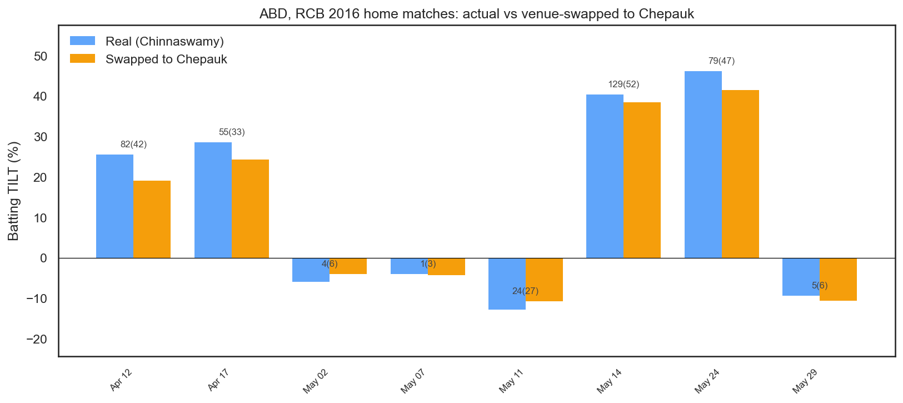
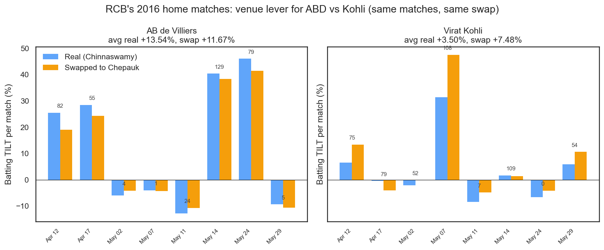
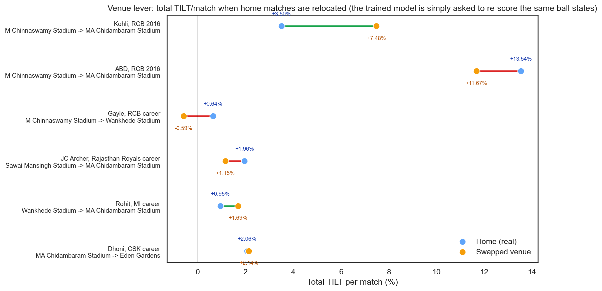

# The Importance of Venue

**How much of a batter's TILT is coming from *where* they played? We relocate six player-cohorts' home matches into the model, one venue swap at a time, and read off the delta.**

Cricket fans carry strong priors about grounds. M Chinnaswamy is a batter's paradise; Chepauk rewards patience and spin; Wankhede swings in the evening. The TILT model has `venue` as a feature in its win-probability classifier, so those narratives are implicitly priced in. This post makes the pricing explicit.

---

## What we're actually measuring

The experiment is simple, but it's worth being precise about what it does and doesn't do.

We take a cohort — say, RCB's eight home matches in IPL 2016 — and in the feature frame, overwrite `venue` to a different ground (Chepauk, Wankhede, anything on a whitelist). Then we re-run the exact same trained LightGBM classifier through `compute_ball_deltas`, the same function that produced the TILT numbers on the leaderboard. Every ball-state — over, runs_scored, wickets_in_hand, required_run_rate, recent_wickets — is unchanged. The only thing that moves is the venue label.

This is a *model-sensitivity* experiment, not a causal one. We are not re-simulating alternate matches; we are asking the trained model "if you'd been told these deliveries happened at Chepauk instead of Chinnaswamy, what would you have scored them as?" The result measures the model's **reliance on the venue feature** — which is correlated with but distinct from real-world venue effects.

A few constraints we enforce:

- **9-venue whitelist**: M Chinnaswamy, Wankhede, Eden Gardens, Chepauk, Rajiv Gandhi (Uppal), PCA Mohali, Arun Jaitley, Sawai Mansingh, Narendra Modi. All have substantial pre-2021 data and are in the model's learned category list. We exclude COVID bio-bubble venues (DY Patil, Sharjah, Dubai, Sheikh Zayed) as swap targets because their `season_numeric × venue` interactions are unstable.
- **DLS-affected matches** are dropped from every cohort.
- **Raw (unshrunk) TILT/match** throughout. The empirical-Bayes shrinkage (k ≈ 5.3) used on the main leaderboard is monotone in the observed value at fixed n, so rankings and signs don't flip; shrunk figures would compress magnitudes ~10–15%.
- **Replay-sanity gate**: before any counterfactual, we re-run the model on the untouched cohort and confirm our delta-sum matches the committed `deltas.parquet` to within 1e-9. It does (ABD 2016 cohort: 0.00e+00 difference).

---

## Start with the example everyone asks about: ABD, RCB 2016, moved to Chepauk

In IPL 2016, RCB played eight home matches at M Chinnaswamy. AB de Villiers faced 216 legal deliveries across those eight games, scored 379 runs, and produced a raw batting TILT per match of **+13.54%** — a genuinely elite eight-match run.

Relocate those deliveries to Chepauk and re-score. His TILT/match falls to **+11.67%**. A drop of **−1.87 percentage points**.

That is smaller than the cricketing caricature would predict. The caricature says Chepauk, with its slower surface and spin, would punish a dominant middle-overs hitter; we'd expect ABD's number to collapse. Instead it moves modestly. His 129(52) against Gujarat Lions on May 14 drops from +40.41% to +38.44%; his 79(47) on May 24 drops from +46.07% to +41.41%. The losses cluster on the dominant innings, not on the failures.

The modesty gets more interesting once you see the full sweep. Across the nine whitelisted targets, his TILT ranges from **+9.28%** (Eden Gardens) to **+14.72%** (Mohali). Chepauk sits in the middle. The venues that drop him are the slower, spin-friendly ones (Eden, Sawai, Chepauk, Wankhede); the venues that *lift* him are the northern, typically higher-scoring ones (Mohali, Motera, Kotla, Uppal). The lever for ABD 2016 spans roughly 5.4pp across those nine grounds — real, but not the earthquake the narrative implies.

---

## The surprise: the same matches, for Kohli, move in the opposite direction

Kohli batted in those same eight matches. His raw TILT/match at Chinnaswamy is **+3.50%** — respectable, well below ABD, well documented elsewhere as one of his lower per-match rates for a famously high-volume season.

Relocate those eight matches to Chepauk and his TILT jumps to **+7.48%**. A rise of **+3.98pp**. Not only is the sign opposite to ABD's, but the magnitude is bigger.

Across the full nine-venue sweep, Kohli's TILT/match ranges from **+3.50%** (his actual home) up to **+7.65%** (Uppal). His home ground is the *lowest* value in the sweep. Every other target lifts him. The biggest single-match movement: his 108(58) chase against Rising Pune on May 7 (the one the paradox post calls his "chase masterclass") goes from +31.40% to **+47.55%** if relocated to Chepauk. Sixteen points, from one venue swap, on a match that was already his best of the season.

So what does it mean that the same swap, on the same eight matches, pulls ABD down and pushes Kohli up?

Roughly, this: the model has learned that Chinnaswamy is high-scoring, so each run there carries a smaller WP shift; moving runs to a harder venue inflates their per-ball weight. ABD's 2016 innings were mostly *already* dominant — by the time a run lands, WP is often already near 1, and relocating those late runs to a harder venue doesn't help (the ceiling gets hit sooner at Chepauk, so his late-innings runs *lose* TILT). Kohli's 2016 matches, full of slow starts and gradual climbs, benefit enormously from a venue where each ball counts more: his scoring gets *more* room to move WP before the innings caps out.

The venue lever, in other words, is not a uniform multiplier on performance. It's specific to the shape of the innings, which is specific to the player.

---

## Gayle: the sweep spans 3.6 percentage points

Gayle played 37 home matches for RCB across his career, 2011 to 2017. Real career TILT at Chinnaswamy is **+0.64%/match**. Relocate to Wankhede: **−0.59%** (−1.22pp). Relocate to Chepauk: **+3.05%** (+2.41pp).

His full nine-venue sweep:

| Target venue | Gayle TILT/match |
|:---|:---:|
| M Chinnaswamy Stadium (home) | **+0.64%** |
| Wankhede Stadium | −0.59% |
| Eden Gardens | +0.23% |
| Sawai Mansingh Stadium | +0.87% |
| Arun Jaitley Stadium | +1.86% |
| PCA IS Bindra Stadium, Mohali | +2.41% |
| Narendra Modi Stadium, Ahmedabad | +2.51% |
| Rajiv Gandhi International, Uppal | +2.55% |
| MA Chidambaram Stadium, Chepauk | **+3.05%** |

The range is 3.6pp — not small for a career-level cohort with 37 matches. And the shape is odd: the venues that look structurally similar to Chinnaswamy (flat, batter-friendly) *suppress* Gayle's TILT; the lower-scoring venues lift him. Again the logic is about where the WP ceiling sits relative to his scoring: Gayle on a Chinnaswamy-clone spends a lot of balls at states the model already considers resolved.

---

## Dhoni at Chepauk: the fortress that isn't

MS Dhoni played 65 matches at Chepauk as a CSK player. His real TILT/match there is **+2.06%**. Swap to Eden: **+2.14%**. Swap to Mohali: **+2.55%**. Swap to Chinnaswamy: **+1.51%**. The full sweep spans **+1.51% to +2.55%** — 1.04pp.

Essentially, the venue lever doesn't find Dhoni. Whatever TILT he generates, he generates largely from match state and game phase, not from the ground. The "fortress Chepauk" narrative is intuitive to anyone who watched CSK win there routinely, but the routine winning came from the team and Dhoni's role within it — not from anything the model attributes to the four letters `MACS` in the feature vector.

---

## Rohit at Wankhede: the home counter-example

Rohit Sharma's 85 career home matches for Mumbai Indians at Wankhede produce a raw TILT/match of **+0.95%**. Swap those matches around and:

| Target venue | Rohit TILT/match |
|:---|:---:|
| Sawai Mansingh Stadium | +0.73% |
| M Chinnaswamy Stadium | +0.81% |
| **Wankhede Stadium (home)** | **+0.95%** |
| Arun Jaitley Stadium | +1.10% |
| Eden Gardens | +1.18% |
| PCA IS Bindra Stadium, Mohali | +1.55% |
| Rajiv Gandhi International, Uppal | +1.50% |
| Narendra Modi Stadium, Ahmedabad | +1.57% |
| MA Chidambaram Stadium, Chepauk | +1.69% |

Six of the eight alternate venues lift him. His actual home ground sits in the bottom third of the sweep. By the model's reckoning, Rohit's Wankhede "home advantage" is, at the margin, a drag on his TILT — he'd score higher on the leaderboard if the same 85 matches had been played at Chepauk (+0.75pp).

This is not a claim that Rohit *is* worse at Wankhede; his actual runs happened there and the counterfactual can't do anything about that. It's a claim that the model reads his ball-state trajectories as slightly more impressive against a harder venue prior than against Wankhede's.

---

## A data-driven pick: JC Archer, the sporadic home-ground case

To widen the roster past famous names we filtered the dataset for players with 30–150 career matches, a primary home venue in the 9-whitelist, and a non-trivial home-ball share — then ranked by observed home-minus-away per-ball TILT gap. Top of the list: Jofra Archer (Rajasthan Royals, 32 matches, Sawai Mansingh as home).

He only has 7 home matches in the cohort — small sample, caveat emptor — but the lever is real and visible.

| Target venue | Archer TILT/match |
|:---|:---:|
| Narendra Modi Stadium, Ahmedabad | +0.21% |
| Eden Gardens | +0.21% |
| MA Chidambaram Stadium, Chepauk | +1.15% |
| PCA IS Bindra Stadium, Mohali | +1.18% |
| M Chinnaswamy Stadium | +1.19% |
| Arun Jaitley Stadium | +1.28% |
| Wankhede Stadium | +1.31% |
| **Sawai Mansingh Stadium (home)** | **+1.96%** |
| Rajiv Gandhi International, Uppal | +2.58% |

His actual home ground sits second from the top. Swap to Uppal: another +0.62pp. Swap to Motera or Eden: a 1.75pp drop. A 2.4pp range on just seven relocated matches.

---

## All six, in one picture

Sorted by absolute delta. Kohli 2016 at the top — a +3.98pp lift for the cohort whose headline number reads worst. ABD 2016 next — a −1.87pp drop for the cohort whose headline number already reads best. Gayle, Archer, Rohit, Dhoni filling out the middle.

The thing worth staring at is that the dots on the two rows for the 2016 cohort are *the same eight matches*, swapped to *the same target*, and they move in *opposite directions*.

---

## What this does and doesn't measure

The venue lever quantified here is the model's reliance on the venue categorical. That is related to, but not the same as, real-world venue effects. Four specific limits worth stating:

- **Opposition is held constant in the model's view but not in reality**. ABD's Chinnaswamy matches were against whatever bowlers RCB faced at home — which is not a random sample of IPL bowling attacks. Relocating those matches holds opposition fixed, which is convenient for the counterfactual but not what would actually happen if RCB played their home slate somewhere else.
- **Era drift is baked in**. The model has more 2017–2024 data for Narendra Modi, Ekana, Holkar; earlier-era venues dominate pre-2020 splits. When a 2016 cohort gets swapped to Motera, you're partly measuring the 2021+ scoring regime, not the 2016 one. Hence the 9-venue whitelist — but even within it, the signal isn't era-neutral.
- **"Relocating the match" ≠ "relocating the player"**. When we swap venue, we swap it for both innings. We're asking the model to rescore the *match*, not to imagine the player in a different team context.
- **It's a model probe, not a physics experiment**. The venue categorical encodes whatever correlation LightGBM's tree splits found useful — pitch behaviour, yes, but also squad composition at that ground, local bowler economies, toss decisions, and the specific batters who happened to play there. The lever is measuring the model's belief about venue, which is correlated with but distinct from venue itself.

---

## Takeaway

Venue is a real feature in TILT, and its lever is player-specific, often small, and occasionally counterintuitive.

For Dhoni the lever barely exists. For Rohit it exists but points the wrong way — his home ground isn't where the model rates him highest. For Kohli 2016 it's large and everywhere-else-is-better; for ABD 2016 it's moderate and mostly goes in the direction stereotypes expect. For Gayle the lever's magnitude depends entirely on which alternate venue you pick: a 3.6pp range across the nine-venue sweep, with the spin-track targets *lifting* him.

The cleanest methodological finding isn't in any individual number. It's that the same eight matches, under the same venue swap, move two batsmen's TILT in opposite directions. That's the signature of a lever that's being filtered through the shape of each player's innings, not a lever that scales uniformly with "how friendly is this ground."

If you came to this post looking for a clean story about venue mattering, the cleanest version is: venue matters for TILT, but it matters to each player in their own way, and sometimes it matters in the direction opposite to what you'd guess.

---

*Source: `notebooks/venue_importance_analysis.py`. Every number above is printed by the notebook's summary block. Replay-sanity gate (commit-equivalence to `deltas.parquet`) passed at 0.00e+00 before any counterfactual was run.*
