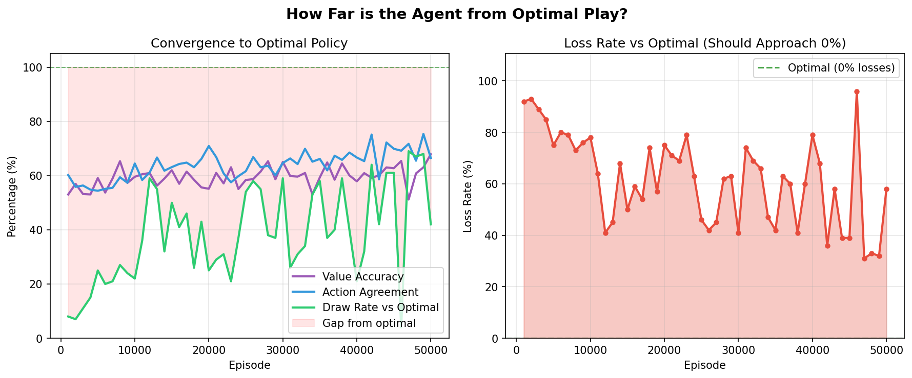
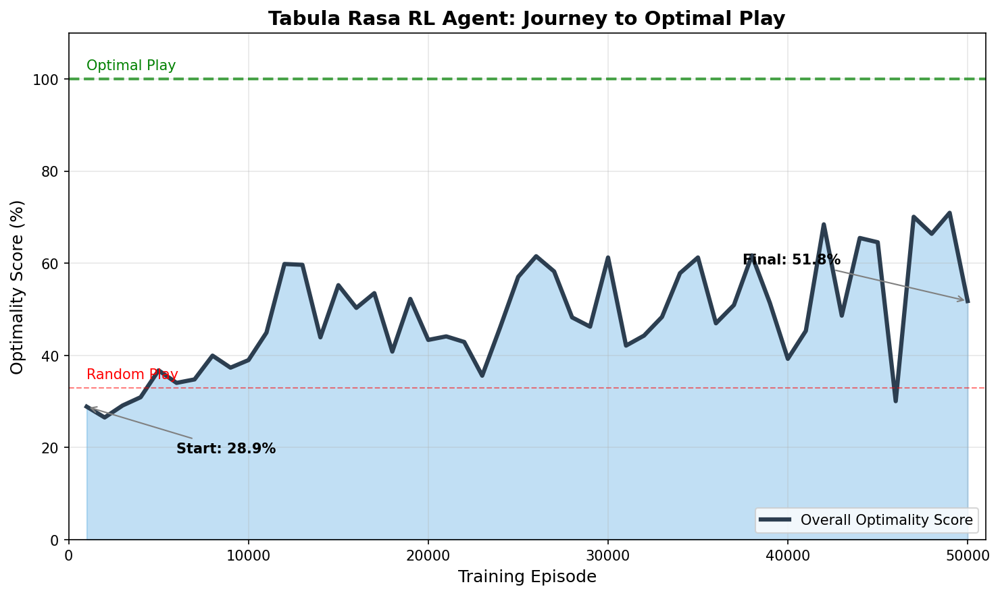

# Tic Tac Toe Q-Learning Results

## Overview

This document summarizes the training results of a tabula rasa Q-learning agent learning to play Tic Tac Toe from scratch.

## Training Configuration

| Parameter | Value |
|-----------|-------|
| Episodes | 50,000 |
| Eval Interval | 1,000 |
| Learning Rate | 0.1 |
| Discount Factor | 0.99 |
| Epsilon Decay | 0.9995 |
| Epsilon Min | 0.01 |

## Results Summary

### Initial Performance (Untrained)
- **vs Optimal Player:** 0% Win, 17% Draw, 83% Loss
- **vs Random Player:** 39% Win, 15% Draw
- **Optimality Gap:** 0.426
- **Action Agreement:** 56.9%

### Final Performance (After 50k Episodes)
- **vs Optimal Player (500 games):** 0% Win, 47.8% Draw, 52.2% Loss
- **vs Random Player (500 games):** 70.2% Win, 18.4% Draw
- **Optimality Gap:** 0.383
- **Action Agreement:** 72.1%

### Agent Statistics
- **Q-table Size:** 16,100 entries
- **Final Epsilon:** 0.01
- **Average Q-value:** 0.022
- **Max Q-value:** 0.9996
- **Min Q-value:** -0.5695

## Key Observations

1. **Learning Progress:** The agent improved from 17% draw rate to ~48% draw rate against the optimal player
2. **Random Opponent:** Win rate against random improved from 39% to 70%
3. **Action Agreement:** Agreement with optimal moves increased from 57% to 72%
4. **Room for Improvement:** Against a perfect player, 100% draws is the best achievable outcome - the agent still has room to improve

## Visualizations

### All Training Metrics


### Optimality Comparison


### Learning Summary


## Demo Game

A sample game between the trained agent (X) and optimal player (O) resulted in a **DRAW**:

```
Final Board:
O X X
X X O
O O X
```

## Notes

- Against an optimal Tic Tac Toe player, the best possible outcome is always a draw (with perfect play from both sides)
- The agent learns entirely through self-play with no prior knowledge (tabula rasa)
- Losses against optimal indicate suboptimal moves being made by the agent
